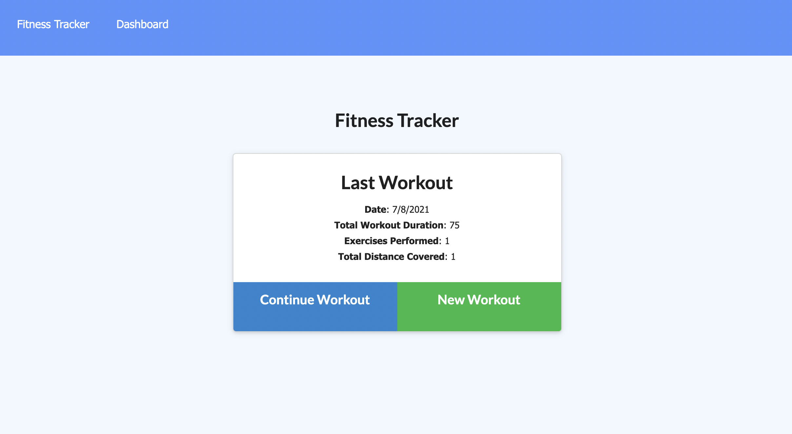
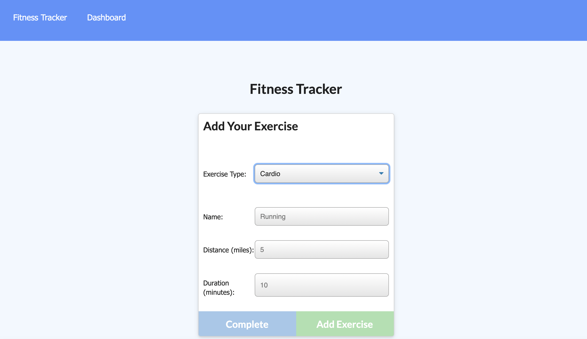
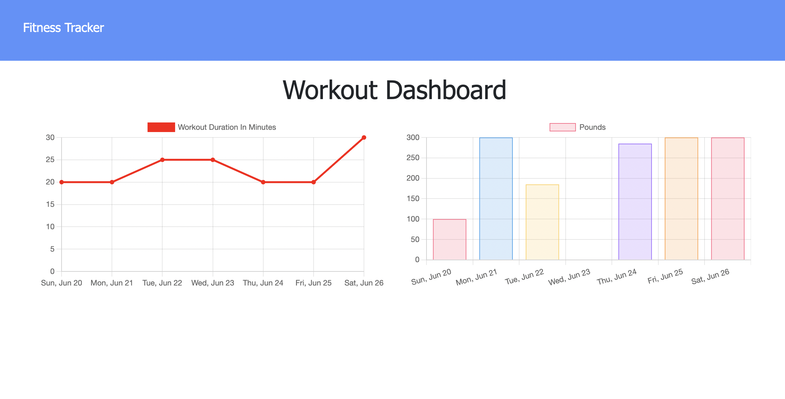

# Project Name:
Workout Tracker

## License
 : [View License](https://opensource.org/licenses/MIT)

## Table of Contents

- [Title](#Project-Name)
- [License](#License)
- [Description](#Description)
- [Installation](#Installation)
- [Questions](#Questions)

## Description
As a user, I want to be able to view create and track daily workouts. I want to be able to log multiple exercises in a workout on a given day. I should also be able to track the name, type, weight, sets, reps, and duration of exercise. If the exercise is a cardio exercise, I should be able to track my distance traveled. A consumer will reach their fitness goals more quickly when they track their workout progress.

## Installation 
Run the following command at the root of your project: npm i OR npm install

## Preview 

## Questions 
For issues, questions, and comments please contact randyfaison@gmail.com or visit [https://github.com/Randyfasion](https://github.com/Randyfasion) 
        